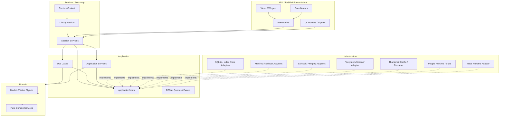
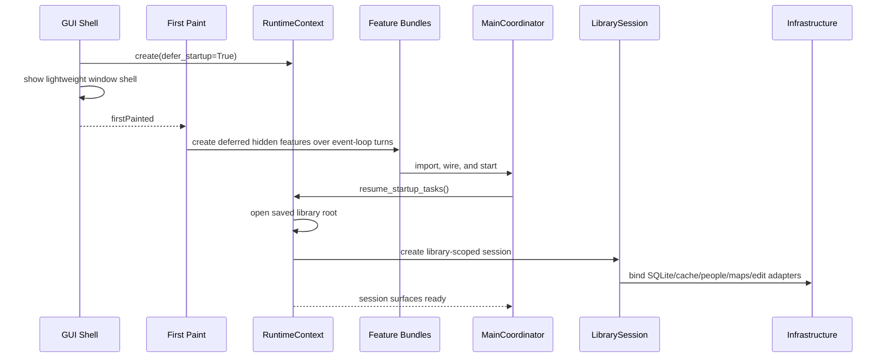
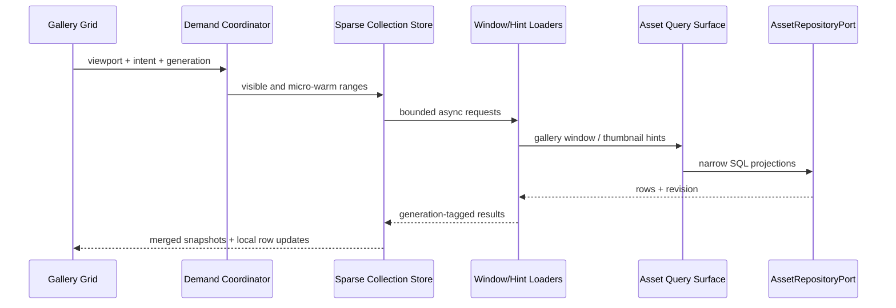
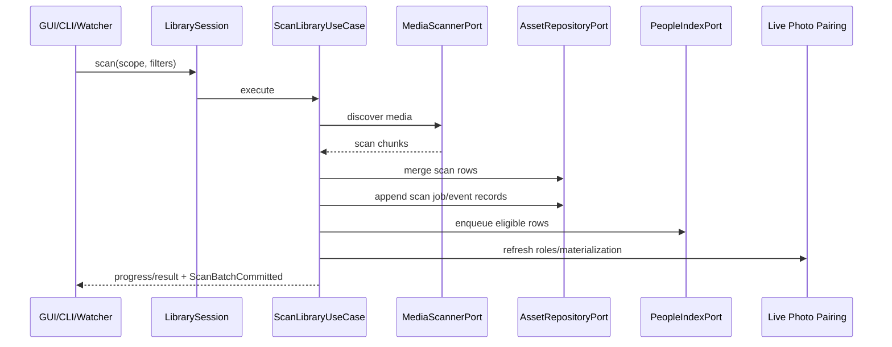
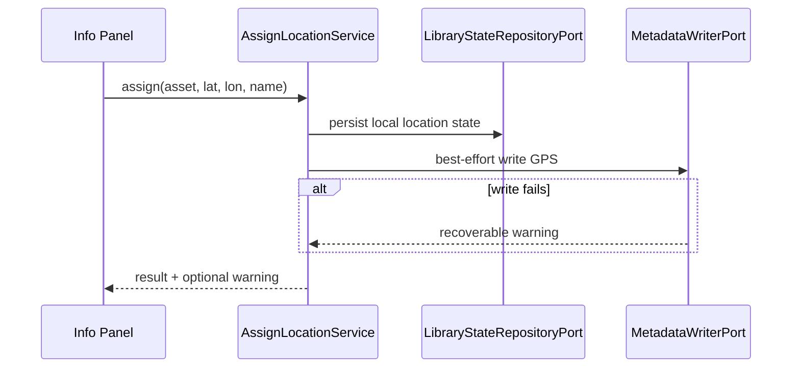
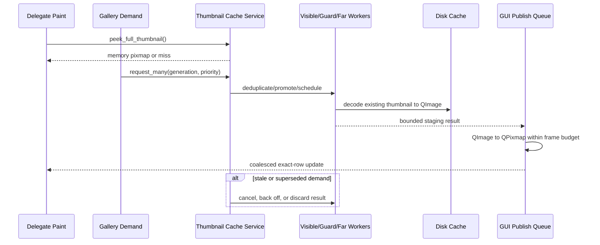

# Architecture vNext

This document describes the current production architecture of iPhotron after
the vNext cleanup. The codebase is a library-scoped modular desktop monolith:
one process-level `RuntimeContext` owns one active `LibrarySession`, and GUI,
CLI, watchers, and workers enter behavior through application surfaces rather
than legacy facades.

For completed migration records and verification history, see
`docs/finished/refactor/vnext-2026-06/`.

## Status

The vNext architecture cleanup is complete for production source code.

- Production runtime code no longer imports `iPhoto.legacy` or `iPhoto.models.*`.
- Compatibility and old domain-repository code is quarantined under
  `src/iPhoto/legacy/` for explicit historical behavior tests only.
- `RuntimeContext -> LibrarySession` is the active library entry path.
- Application ports and services define the boundary used by GUI, CLI, workers,
  People, Maps, Edit, thumbnails, and lifecycle operations.
- Architecture guardrails are enforced by `tools/check_architecture.py` and
  `tests/architecture`.

The remaining pre-release checks are product validation tasks, such as manual Qt
GUI smoke testing and opening an existing library. They do not change the
architecture convergence status.

## Product Principles

- **Folder-native library.** The filesystem remains the user's album structure.
  A folder is an album, and browsing must not require import.
- **Local-first runtime.** Library state lives under `<LibraryRoot>/.iPhoto/`.
  Core workflows do not depend on cloud services.
- **Non-destructive editing.** Visual edits are persisted as `.ipo` sidecars.
  Original media is preserved.
- **Explicit metadata write-back.** Assign Location persists local state first,
  then best-effort writes GPS metadata to original media through ExifTool and
  reports warnings on failure.
- **Rebuildable facts vs durable choices.** Scan rows, thumbnails, Live Photo
  materialization, and People runtime snapshots can be rebuilt. Favorites,
  hidden/trash state, pinned items, covers, ordering, manual metadata, People
  names, groups, covers, hidden flags, and manual faces are durable user state.
- **Optional bounded contexts.** People AI and Maps native/runtime extensions
  are optional and must degrade gracefully when missing.
- **Cross-platform desktop first.** macOS, Windows, and Linux are supported
  through runtime adapters and platform-specific rendering choices.

## Architecture Shape



Allowed dependency direction:

```text
gui -> bootstrap/runtime -> application -> domain
infrastructure -> application ports / domain values
bounded contexts -> application ports / domain values
```

Forbidden dependency direction:

```text
domain -> application/gui/infrastructure
application -> gui/concrete cache/concrete infrastructure
infrastructure/cache/core/io/library/people -> gui
production runtime -> iPhoto.legacy
production runtime -> iPhoto.models.*
```

## Runtime Contract

`RuntimeContext` is the process composition root.

```text
RuntimeContext
  settings
  translation
  theme
  library
  facade
  event_bus
  asset_runtime
  recent_albums
  defer_startup_tasks
  container
  library_session: LibrarySession | None
  open_library(root)
  close_library()
  resume_startup_tasks()
  remember_album(root)
```

`LibrarySession` owns library-scoped adapters and exposes application-facing
surfaces.

```text
LibrarySession
  library_root
  state_repository
  assets
  state
  asset_queries
  asset_state
  album_metadata
  scans
  asset_lifecycle
  asset_operations
  thumbnails
  people
  maps
  map_interactions
  edit
  locations
  assign_location_service()
  shutdown()
```

CLI and other non-GUI callers create the same session boundary through
`create_headless_library_session(root)`.

Production GUI and CLI do not create standalone fallback services. If no active
session exists, GUI services should fail explicitly or no-op safely according to
their presentation responsibility.

`TranslationManager` is created after settings and before theme initialization.
It reads `ui.language`, installs the active Qt translator, exposes
`languageChanged`, and falls back to English when the requested or system
language has no bundled resource. The active stored language values are
`system`, `de`, and `zh-CN`; the language menu presents `system` as `English`.

Desktop construction deliberately has two boundaries. The process first loads
settings, configures graphics caches, creates `QApplication`, `RuntimeContext`,
and the lightweight main-window shell, then calls `show()`. Only after the shell
emits `firstPainted` may startup create hidden feature bundles, import and start
`MainCoordinator`, resume library startup tasks, or select the initial
collection. This is an architecture constraint rather than a timer-based
optimization: optional feature imports must not migrate back above the first
paint boundary.

`Ui_MainWindow.ensure_feature()` owns the on-demand lifetime of the detail,
preview, Map, People, and Albums bundles. It caches each bundle and emits
`featureCreated` so the window manager and coordinator can attach behavior to
late-created widgets. Navigation may also call `ensure_feature()` if Map or the
Albums dashboard was not constructed during the post-paint warm-up. On Windows,
the QRhi-backed detail bundle is constructed before `show()` because inserting
it into a visible top-level window can recreate the native window; preview and
People remain post-paint. Other desktop platforms defer all three.

## Layer Boundaries

### Domain

`domain/` owns dataclasses, value objects, query models, and pure domain
services. It must not import Qt, SQLite, filesystem-writing adapters, ExifTool,
FFmpeg, GUI helpers, or runtime singletons.

### Application

`application/` owns workflow use cases, application services, DTOs, queries,
events, and port protocols. Application code depends on ports and domain values.
It must not import GUI modules, concrete persistence modules, Qt workers,
widgets, or process-wide repository singletons.

Current public boundary names include:

| Port | Responsibility |
| --- | --- |
| `AlbumRepositoryPort` | Folder-local album manifest read/write without exposing legacy shims upstream. |
| `AssetRepositoryPort` | Asset query, count, scan merge, state update, and transaction semantics for the current library store. |
| `AssetFavoriteQueryPort` | Favorite-state reads through a session-owned query surface. |
| `AssetStateServicePort` | Durable asset-state commands such as favorite toggles. |
| `EditServicePort` | Session-scoped edit sidecar and render-state surface. |
| `EditSidecarPort` | `.ipo` read/write and edit state persistence. |
| `LibraryStateRepositoryPort` | Durable library user-state boundary for favorites, hidden/trash, pinned/order, and related state. |
| `LocationAssetServicePort` | Session-bound geotagged asset queries. |
| `LocationMetadataPort` | Explicit location assignment metadata write/read-back boundary. |
| `MediaScannerPort` | Media discovery and normalized scan candidates without persistence ownership. |
| `MetadataReaderPort` | Image/video metadata reads. |
| `MetadataWriterPort` | Explicit best-effort metadata writes such as Assign Location GPS write-back. |
| `MapInteractionServicePort` | Marker-click and map interaction semantics. |
| `MapRuntimePort` | Maps extension availability and runtime adapter selection. |
| `PeopleAssetRepositoryPort` | Asset-index reads and face-status updates used by the People bounded context. |
| `PeopleIndexPort` | People scan candidate enqueue, snapshot commit, and People/group queries. |
| `PinnedStateRepositoryPort` | Pinned sidebar state persistence across libraries. |
| `TaskSchedulerPort` | Background task submission and cancellation boundary. |
| `ThumbnailRendererPort` | Thumbnail/preview generation without GUI ownership. |

### Large Library Query And Scan Contracts

Large-library browsing is part of the current production architecture, not a
future side design. The active query path is SQL-first and windowed:

- `CollectionQuery`, `PageCursor`, `PageResult`, and `WindowResult` describe
  collection intent, keyset pages, and bounded viewport windows.
- `LibraryAssetQueryService` converts supported `AssetQuery` reads to
  repository-backed collection SQL for All Photos, albums, favorites, videos,
  maps/GPS, media type, and date filters.
- `GalleryCollectionStore` treats `asset_at()` as cache-only and loads bounded
  windows asynchronously through `GalleryWindowLoader` and
  `read_gallery_asset_window()`; direct row lookup uses `find_row_by_path()`
  rather than scanning the model. Loaded chunks are merged into a bounded
  sparse cache, and stale generation/revision results are discarded.
- Gallery SQL has two narrow projections in addition to the general collection
  window: `read_gallery_collection_window()` returns tile-rendering fields, and
  `read_thumbnail_hint_window()` returns only paths and existing full-thumbnail
  keys without repeating the collection count.
- `GalleryViewportDemand` is the contract between scrolling, sparse row loading,
  and thumbnail scheduling. It separates visible rows, the full-thumbnail guard,
  far speculative full-thumbnail work, and the wider micro-thumbnail warm range.
- Delegates consume one `GalleryTileSnapshot` through `TILE_SNAPSHOT`. A paint
  miss must remain memory-only; it schedules bounded background work and paints
  an available micro thumbnail or placeholder instead of reading SQLite or L2.
- Normal gallery collections default to `thumbnail_state='ready'` and require a
  non-empty `thumb_cache_key`; stale, pending, failed, or old no-key rows are
  repair/backfill candidates, not visible media grid rows.
- Scan publishing uses `ScanBatchCommitted`, split into small ready-row batches
  after DB commit. Production code must not restore the old `scanChunkReady`
  transport for real-time UI updates.
- `scan_jobs` and `scan_events` persist job state, stage changes, batch commit
  metadata, and stage timing for scan observability.

### Infrastructure

`infrastructure/` owns concrete adapters: SQLite-backed state, manifest and
sidecar persistence, ExifTool/FFmpeg wrappers, filesystem scanners, thumbnail
caches/renderers, maps runtime discovery, and supporting runtime services. It
implements application ports and may depend on domain values. It must not import
GUI modules or own product workflow decisions.

### GUI

`gui/` owns PySide6 presentation: views, widgets, controllers, viewmodels,
coordinators, menus, shortcuts, Qt workers, and signal adapters. GUI code calls
session/application surfaces and does not directly write durable state or call
concrete repository singletons.

User-visible GUI text goes through the Qt translation boundary. New strings
should use `iPhoto.gui.i18n.tr(context, source_text)` or
`QCoreApplication.translate(...)` with a stable context. Long-lived widgets
refresh translated labels through `retranslate_ui()`; the main window wires
`TranslationManager.languageChanged` to `retranslate_ui_tree()` so runtime
language switches update menus, tooltips, pages, and status text without
rebuilding the active library session. Business logic must use stable command
ids, node types, callbacks, or `QAction.data()` rather than translated labels.

Bundled i18n resources live in `src/iPhoto/resources/i18n/`:

| Resource | Responsibility |
| --- | --- |
| `languages.json` | Advertises supported UI language choices and Qt locales. |
| `iPhoto_de.ts` / `iPhoto_zh_CN.ts` | Qt Linguist source translations. |
| `iPhoto_de.qm` / `iPhoto_zh_CN.qm` | Compiled translators loaded at runtime. |

Package data includes `.ts` and `.qm` files so editable installs and packaged
builds can load the same resources.

### Library Runtime

`library/` contains the production runtime controller, album tree/watch shells,
scan coordination, and trash/filesystem orchestration bound to session services.
It is not a legacy manager facade.

### Bounded Contexts

- `people/`: optional face detection/clustering runtime, People repositories,
  stable People state, manual faces, groups, covers, and People service API.
- `src/maps`: optional offline map runtime, tile parsing, OBF/native
  widget/helper integration, search, and map rendering internals. GUI map
  views construct concrete map widgets through `map_widget_factory`.
- `core/`: editing math, filters, geometry, preview backends, export transforms,
  raw loading, and Live Photo pairing rules.
- `cache/index_store/`: current global SQLite index implementation used behind
  repository/session surfaces, not a public GUI/application shortcut.

## Persistence Model

Each library root owns a `.iPhoto/` workspace.

| Path | Ownership |
| --- | --- |
| `.iPhoto/global_index.db` | Current SQLite asset index and repository-backed state store for scan rows, pagination, Live Photo roles, trash/favorite/hidden state, face scan status, and related library state. |
| `.iPhoto/links.json` | Derived Live Photo compatibility materialization; repository/session Live Photo role state remains authoritative for runtime behavior. |
| `.iPhoto/cache/thumbs/` | Rebuildable thumbnail cache. |
| `.iPhoto/faces/face_index.db` | Rebuildable People runtime snapshot. |
| `.iPhoto/faces/face_state.db` | Durable People user state: names, covers, hidden flags, order, groups, pinned state, group covers, and manual faces. |
| `.iPhoto/faces/thumbnails/` | Rebuildable cropped face thumbnails. |
| `.ipo` sidecars | Durable non-destructive edit instructions next to source media. |
| `.iphoto.album.json` / `.iPhoto/manifest.json` | Folder-local album metadata formats. |
| `.iphoto.album` | Legacy album marker compatibility file. |

Implementation stages may continue storing scan facts and some user state in the
same SQLite file, but repository APIs and merge behavior must maintain the
logical boundary: scans may rebuild facts and must not implicitly delete durable
choices.

## Core Flows

### Library Startup



Headless callers do not use the paint boundary; they create the same
library-scoped session directly. Scan workers, geocoding, People AI, Qt
Multimedia, and Maps rendering remain demand-loaded by their owning workflow.

### Open Collection



GUI viewmodels may cache window/selection state, but repository/session surfaces
remain the source of truth for persisted asset state. Explicit detail-view row
loads are retained independently from newer viewport generations so navigation
does not lose an in-flight target.

### Scan And Index



Scanning has one application use case. Qt workers adapt threading/progress, and
CLI uses the same session surface without Qt. UI scan batches are ready-only and
carry full thumbnail cache keys so visible media rows are immediately drawable.

### Assign Location



The local assignment is authoritative. ExifTool failures are warnings and do not
roll back local state.

### Thumbnail Rendering



Visible recovery, near guard, and far speculation use separate scheduling lanes;
far work must not consume workers reserved for urgent visible/guard requests.
`ThumbnailRuntimePolicy` derives worker, staging, publish, and byte-budget limits
from platform and physical memory. L1 eviction accounts for actual image bytes,
pins active visible demand, and prefers old/far speculative entries. Disk access
and image decoding stay off the GUI thread; only bounded `QPixmap` publication
runs there. Thumbnail infrastructure may apply edit state, but edit persistence
remains behind session/edit sidecar services.

## Legacy Quarantine And Removal Policy

`src/iPhoto/legacy/` contains quarantined compatibility modules, including old
root compatibility paths such as `legacy/app.py` and `legacy/appctx.py`, old
bootstrap factory shims, old domain-repository use cases, old repository
adapters, and old model shims.

Rules:

- Production runtime must not import `iPhoto.legacy`.
- Production runtime must not import `iPhoto.models.*`.
- No new functionality goes into quarantine modules.
- Tests that cover historical behavior must import quarantine modules
  explicitly.
- The whole quarantine subtree is planned for deletion in the next major
  release.

## Architecture Guardrails

Run:

```bash
python3 tools/check_architecture.py
python tools/check_i18n_strings.py src/iPhoto/gui src/maps
.venv/bin/python -m pytest tests/architecture -q
```

The guardrails enforce:

- runtime `AppContext` imports are not reintroduced;
- coordinators do not import collection-store implementation types directly;
- vNext layer boundaries are respected;
- `application/` does not import GUI or concrete persistence;
- `infrastructure/` does not import GUI;
- production runtime does not import quarantined legacy paths or old model
  shims.
- high-risk GUI APIs do not receive direct English literals that bypass the
  translation boundary.

The GitHub Actions workflow also runs `python tools/check_architecture.py`
before the broader test suite.

## Decision Log

### ADR-1: Folder-Native Albums

Folders remain albums. Manifests store folder-local metadata, while global
browsing/indexing state lives in the library database and session surfaces.

### ADR-2: Library-Scoped Runtime

One active library root owns one runtime session, one asset index, one thumbnail
cache root, one People state root, and one Maps runtime context.

### ADR-3: Application Ports Over Concrete Singletons

Use cases and application services depend on ports. Concrete SQLite, ExifTool,
FFmpeg, thumbnail, People, edit, and Maps implementations are bound through
runtime/session composition.

### ADR-4: Single Asset Repository Boundary

Asset persistence is exposed through one public application port. The current
SQLite global index implementation is used behind that boundary; GUI and
application code must not bypass it.

### ADR-5: Single Scan Use Case

Scanning is an application workflow. GUI workers, CLI commands, watchers, and
runtime refreshes adapt the same scan/session surface so progress, cache checks,
metadata fallback, People enqueueing, and Live Photo pairing stay consistent.

### ADR-6: Durable People State Split

People runtime scan output is rebuildable. Human-authored People state is
durable and survives rescans, reclustering, app restarts, and model changes.

### ADR-7: Platform Rendering Behind Adapters

OpenGL, QRhi/Metal, native OsmAnd widgets, helper-backed map renderers, and CPU
fallbacks are runtime-selected adapters. Product workflows must not depend on a
specific rendering backend.

## Acceptance Criteria

The current production source satisfies the vNext architecture criteria when:

- GUI, CLI, watchers, and workers enter through `RuntimeContext`,
  `LibrarySession`, and application/session surfaces.
- Asset persistence is exposed through `AssetRepositoryPort` and state-specific
  application ports.
- Scanning is owned by `ScanLibraryUseCase`, with Qt and non-Qt adapters around
  it.
- `application/` has no direct concrete persistence or GUI imports.
- `infrastructure/` has no GUI imports.
- production runtime has no `iPhoto.legacy` or `iPhoto.models.*` imports.
- architecture checks are in CI.
- key product behavior remains covered: folder browsing, global indexing, Live
  Photos, People, Maps fallback, editing, location assignment, trash,
  import/move/delete/restore, and export.

Recommended verification after architecture-sensitive changes:

```bash
python3 tools/check_architecture.py
.venv/bin/python -m pytest tests/architecture -q
.venv/bin/python -m pytest tests/application/test_runtime_context.py tests/application/test_library_session.py tests/application/test_scan_library_use_case.py -q
.venv/bin/python -m pytest tests/application/test_temp_library_end_to_end.py tests/application/test_library_asset_lifecycle_service.py tests/services/test_asset_move_service.py tests/services/test_restoration_service.py -q
.venv/bin/python -m pytest tests/performance -q
```
