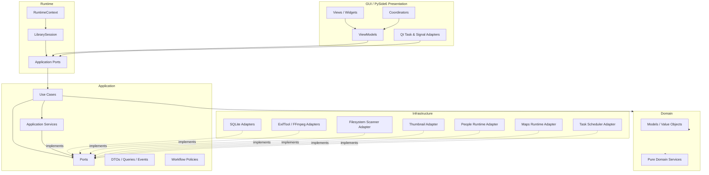
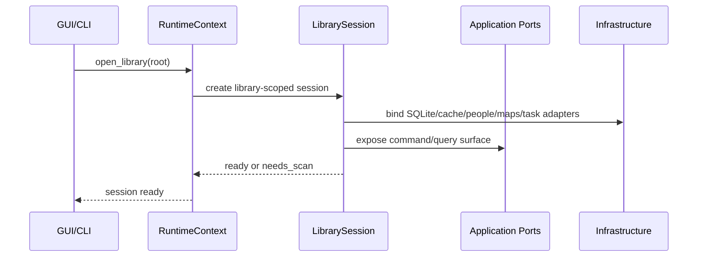
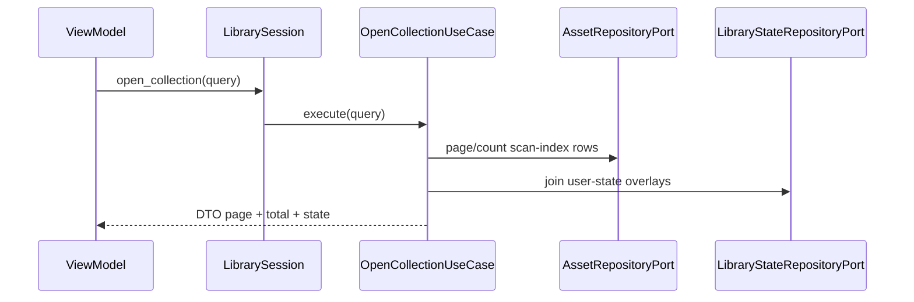
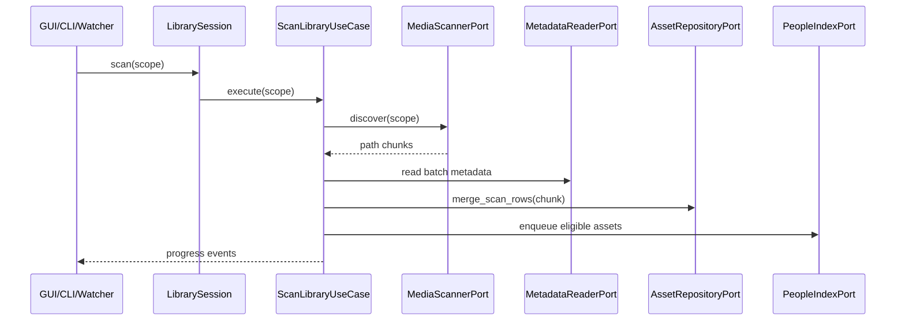
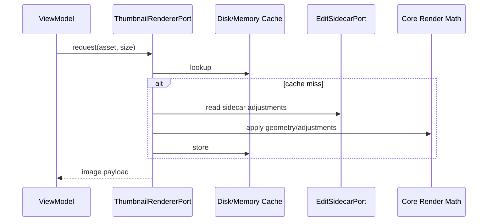

# 01 - Target Architecture vNext

> 目标：把 iPhotron 收敛为 library-scoped modular desktop monolith。
> 它仍然是本地优先的桌面应用，但业务入口、状态边界和后台任务模型必须统一。

## 1. 架构结论

当前架构不是最终最优目标，但已经具备正确骨架：

- GUI 使用 PySide6，并已开始向 MVVM、coordinator、viewmodel 收敛。
- `RuntimeContext` 已经成为桌面启动入口。
- `.iPhoto/global_index.db` 已经成为 library 级资产索引。
- People、Maps、Live Photo、非破坏编辑、缩略图、GPU pipeline 已经形成较清晰的能力域。

主要问题是执行路径仍然分裂：

- `cache/index_store.AssetRepository` 与 `infrastructure/repositories/SQLiteAssetRepository` 并存。
- `app.rescan()`、`ScannerWorker`、`ScanAlbumUseCase`、`LibraryUpdateService` 等扫描入口并存。
- `app.py`、`appctx.py`、`iPhoto.models.*` 等兼容层仍被运行时代码依赖。
- application 层仍存在直接调用 concrete singleton 的路径。
- infrastructure 层仍存在导入 GUI 工具函数的路径。

vNext 目标不是大面积推倒，而是建立唯一运行时会话、唯一应用边界和可验证的依赖方向。

## 2. 目标总览



目标依赖方向：

```text
gui -> application -> domain
runtime -> application ports
infrastructure -> application ports / domain values
bounded contexts -> application ports / domain values
```

禁止方向：

```text
domain -> application/gui/infrastructure
application -> gui/concrete cache/concrete infrastructure
infrastructure/cache/core/io/library/people -> gui
```

## 3. Runtime 与 LibrarySession

`RuntimeContext` 是进程级 composition root。vNext 中它只拥有一个活动
`LibrarySession`，所有 GUI、CLI、后台任务和未来自动化入口都通过 session 调用应用层。

目标形态：

```text
RuntimeContext
  settings
  theme
  recent_libraries
  library_session: LibrarySession | None
  open_library(root)
  close_library()
  resume_startup_tasks()

LibrarySession
  library_root
  paths
  repositories
  commands
  queries
  tasks
  thumbnails
  people
  maps
  shutdown()
```

规则：

- `RuntimeContext` 负责进程级依赖装配和当前 library 生命周期。
- `LibrarySession` 负责 library-scoped 依赖，例如数据库连接、缩略图缓存、People 状态、地图运行时。
- `app.py` 只能作为兼容 facade，不能继续接收新业务。
- `appctx.py` 只能作为旧 GUI 构造路径的兼容 proxy。
- `LibraryAssetRuntime` 的职责最终并入或挂接到 `LibrarySession`。

## 4. 应用端口归属

端口统一归属到目标包 `application/ports/`。当前 `application/interfaces.py`、
`domain/repositories.py`、部分 service protocol 可以迁移或桥接到该包。

目标端口：

| Port | 责任 |
| --- | --- |
| `AssetRepositoryPort` | 查询、分页、计数、扫描 merge、用户状态读写、事务边界。 |
| `AlbumRepositoryPort` | 读取/写入 folder manifest、album tree metadata、marker 文件。 |
| `LibraryStateRepositoryPort` | 持久化 favorites、hidden、trash、pinned、排序、用户覆盖项等人为选择。 |
| `MediaScannerPort` | 文件发现、路径规范化、输出扫描候选，不决定持久化生命周期。 |
| `MetadataReaderPort` | 批量读取图片/视频 metadata。 |
| `MetadataWriterPort` | 用户显式操作下 best-effort 写入 EXIF/QuickTime metadata。 |
| `ThumbnailRendererPort` | 生成缩略图、预览图，不拥有 GUI 线程。 |
| `PeopleIndexPort` | People 扫描候选入队、runtime snapshot 提交、People/group 查询。 |
| `MapRuntimePort` | 地图扩展可用性、搜索、瓦片/OBF/native widget 运行时适配。 |
| `TaskSchedulerPort` | 后台任务提交、取消、进度事件和任务生命周期。 |
| `EditSidecarPort` | `.ipo` 读写、编辑状态查询、非破坏编辑持久化。 |

原则：

- use case 依赖 port，不依赖 concrete repository、Qt worker、ExifTool、FFmpeg、SQLite singleton。
- infrastructure adapter 实现 port，可以依赖 SQLite、filesystem、ExifTool、FFmpeg、Qt runtime adapter。
- domain 只表达模型和值对象，不拥有 repository interface。旧 `domain/repositories.py` 在迁移期保留。

## 5. 持久化模型

当前 `.iPhoto/global_index.db` 承担了扫描索引和部分用户状态。vNext 要明确拆分：

```text
/<LibraryRoot>/.iPhoto/
  global_index.db       # 可重建扫描索引和派生事实
  library_state.db      # 不可丢失的人为选择，目标状态库
  links.json            # Live Photo pairing 兼容 materialization
  cache/thumbs/         # 可重建缩略图缓存
  faces/
    face_index.db       # 可重建 People runtime snapshot
    face_state.db       # 不可丢失 People 用户状态
    thumbnails/         # 可重建 face thumbnail cache
```

### 5.1 可重建扫描事实

可重建内容包括：

- 文件路径、大小、mtime、hash、media type。
- EXIF/QuickTime metadata 的扫描结果。
- Live Photo pairing 结果。
- 派生缩略图和 preview cache。
- People runtime detection/clustering snapshot。

这些内容可以通过重新扫描和重新计算恢复。

### 5.2 持久用户状态

不可丢失内容包括：

- favorite、hidden、trash/restore decision。
- pinned items、album order、manual sort。
- 用户设置的 cover、featured、manual metadata override。
- People names、covers、hidden flags、groups、group order、manual faces、group covers。

实现阶段允许继续使用单个 SQLite 文件，但逻辑边界必须拆分：

- 可重建表可以 prune/rebuild。
- 用户状态表只能由显式用户操作变更。
- scan merge 不能隐式清空用户状态。

People 当前的 `face_index.db` / `face_state.db` 是全项目状态拆分范式。

## 6. 核心数据流

### 6.1 打开 Library



### 6.2 打开 Album / Collection



### 6.3 扫描



扫描规则：

- 只有一个扫描 use case。
- Qt worker 只负责线程、取消和信号适配。
- CLI、watcher 和 GUI 使用同一个 use case。
- 扫描默认 additive，不把缺失文件直接解释为用户删除。
- prune/trash/delete 是单独 lifecycle use case。

### 6.4 缩略图



规则：

- thumbnail adapter 不能导入 GUI helper。
- 纯 geometry 和 adjustment 进入 `core/`。
- GUI loader 只负责把结果绑定到 model/view。

### 6.5 People

People 是 bounded context，但对外只暴露 application port：

- scan use case 提交 face-eligible assets。
- People runtime 维护可重建 snapshot。
- People stable state 维护人工命名、合并、隐藏、分组、封面、排序。
- People UI 不直接写 face database，而是调用 People application service/port。

### 6.6 Maps

Maps 保持 optional extension：

- `src/maps/tiles/extension/` 是 packaged/local runtime。
- map native widget、OBF helper、tile backend 都在 maps bounded context 内。
- 主应用通过 `MapRuntimePort` 查询可用性、聚合地理资产、触发地图展示。
- Maps 缺失或 native runtime 不可用时，library、People、Live Photo、editing 不受影响。

### 6.7 Edit

编辑保持非破坏：

- `.ipo` 是编辑状态持久化来源。
- GPU/QRhi/OpenGL 是 rendering adapter，不是业务状态来源。
- `core/` 保存纯 adjustment、geometry、filter math。
- GUI edit widgets 只发送用户意图，保存动作通过 application use case 或 edit sidecar port。

### 6.8 Import / Move / Delete / Restore

资产生命周期 use case 必须统一：

- Import：复制/接收文件，扫描具体文件，merge scan rows，保留冲突报告。
- Move：移动文件，更新 scan index 路径，迁移用户状态 overlay。
- Delete：移动到 trash 或标记 trash state，不直接丢失用户状态。
- Restore：恢复文件路径与用户状态，必要时重新扫描 metadata。

这些流程不应在 GUI worker 中保留唯一业务规则。

## 7. Compatibility Surface

迁移期允许存在，但不允许继续扩张：

| Module | 目标角色 |
| --- | --- |
| `iPhoto.app` | 兼容 facade，逐步转发到 LibrarySession/use cases。 |
| `iPhoto.appctx` | RuntimeContext proxy，仅支持旧 GUI 构造路径。 |
| `iPhoto.models.album` | Manifest compatibility shim。 |
| `iPhoto.models.types` | Legacy Live Photo dataclass shim。 |
| `iPhoto.io.scanner_adapter` | 临时 scanner bridge。 |
| `iPhoto.library.manager` | GUI-era coordination shell，逐步瘦身。 |
| `iPhoto.gui.facade` | Presentation facade，不再拥有业务编排。 |

新增业务不得直接写入这些模块。

